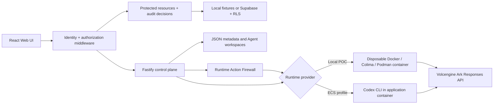

# Agent Trust Gateway

A Human Identity + User → Agent authorization middleware built on the Volc
Agent Launchpad starter kit. The existing Agent CRUD, browser Playground,
persistent workspaces, and Codex/Ark Runtime remain intact.

Run it locally with Docker, Colima, or rootless Podman, or deploy it to
Volcengine ECS.

> [!NOTE]
> This is a hackathon proof of concept with synthetic protected resources. The
> authorization boundary is real and server-enforced, and the disposable
> Runtime adds defense-in-depth container hardening. Ordinary containers are
> still not presented as hardened multi-tenant isolation. See
> [SECURITY.md](SECURITY.md).

> [!IMPORTANT]
> Agent Pass / Trust Pass delegation is **not implemented** in this version.
> There is no temporary, one-use, or cross-owner grant: an Agent remains
> exclusively owned by its creator, and a different signed-in user is denied.
> The Human → Agent → resource display is an attribution path, not a
> transferable credential.

## Screenshots

### Agent Playground


### Create an Agent


## Features

- React and TypeScript Web UI
- Frontend, Backend, and QA engineering login identities
- Server-side Human → Agent ownership enforcement on every Agent/Run route
- Owner-scoped protected resource and workspace-file gateways with visible
  `ALLOW` / `DENY` decisions
- Agent workspace `file.read` middleware with canonical-path, secret, size, and
  symlink-escape checks
- Runtime Action Firewall with pre-dispatch audit decisions and Codex shell
  execpolicy rules
- Explicit Agent revocation that cancels active work and fail-closes future
  actions
- Security demo console with live scenario results, selected-Agent trust
  totals, and filtered audit evidence
- HttpOnly sessions, append-only audit evidence, and a Supabase Auth/RLS adapter
- Agent create, edit, start, stop, delete, and multi-turn chat
- Fastify control plane with asynchronous Run state
- Persistent Agent workspaces and Codex sessions
- Disposable Docker, Colima, or Podman container for each local turn
- Docker and Terraform deployment paths for Volcengine ECS

## Requirements

- Node.js 22+
- npm 10+
- Docker, Colima, or Podman
- A Volcengine Ark API key and endpoint that supports the Responses API

Codex CLI is included in the Runtime image and is not required on the host.

Set `CODEX_BIN` in the root `.env` to choose the Codex executable. The value is
used exactly as configured; when it is absent, local-process Runtime uses
`codex.cmd` on Windows and `codex` on Linux/macOS. Set
`CONTAINER_CODEX_BIN=codex` for the Linux Runtime image; the server rejects
Windows paths and `.cmd` launchers for that boundary. `GET /api/system` exposes
the active Runtime executable name and availability status without exposing
credentials.

To test only login, ownership, protected files, and the audit UI, Node.js is
enough—no model key or container engine is required:

```powershell
npm ci
$env:AUTH_MODE="demo"
$env:HOST="127.0.0.1"
npm run dev
```

Open <http://localhost:5173> and choose an engineering identity:

| Identity | Login email | Owned protected resource |
| --- | --- | --- |
| Frontend | `frontend@bytedance.com` | **Profile page requirements** (`profile-page-requirements.md`) |
| Backend | `backend@bytedance.com` | **Profile API contract** (`profile-api-contract.md`) |
| QA | `qa@bytedance.com` | **Profile release test plan** (`profile-release-test-plan.md`) |

In demo mode, select the identity in the login screen. In Supabase mode, use
the same email and the demo password configured by the operator; no password
belongs in this repository.

Create an Agent for the signed-in identity, open **Access & audit**, and read
that identity's resource. Then select another identity's resource to show a
backend-produced `AGENT_RESOURCE_OWNER_MISMATCH` denial. A realistic Playground
task for each coding Agent is:

- **Frontend:** `Create a typed profile-page state model for loading, ready,
  empty, and error states; add tests and run them.`
- **Backend:** `Create a typed profile API handler with input validation and
  tests for success, missing profiles, and invalid IDs; run the tests.`
- **QA:** `Create an executable profile-release smoke-test suite covering the
  happy path, validation errors, and an authorization regression; run it.`

To prove that the UI is not the security boundary, first create an Agent under
two different identities. Open **Access & audit**, find **Cross-team Agent**,
and select **Run scenario**. The UI calls the backend's opaque cross-owner
probe; it does not receive a foreign Agent ID or name.

The expected result is HTTP `403`, error code `AUTHORIZATION_DENIED`, and
decision reason `HUMAN_AGENT_OWNER_MISMATCH`. The target is labelled
`Protected Agent`, the denied decision is persisted for the signed-in
principal, and no Runtime is invoked.

The same **Access & audit** view shows the selected Agent's real allowed and
denied totals plus its latest decision. Its live scenario cards exercise safe
workspace-file access, secret protection, traversal denial, and Runtime shell
blocking against the backend. No browser-side decision is generated or
assumed. See [the file authorization demo](docs/FILE_AUTHORIZATION_DEMO.md) for
the security boundary and walkthrough.

## Local browser SOP

### 1. Check the local tools

Install Node.js 22+ and one supported container engine, then verify them:

```bash
node --version
npm --version
docker --version        # Docker Desktop, Docker Engine, or Colima
podman --version        # Use this instead when running Podman
```

Only one container engine is required. Codex CLI is already included in the
Runtime image.

### 2. Clone the repository

```bash
git clone <repository-url> volc-agent-launchpad
cd volc-agent-launchpad
```

Skip this step when already working from the repository root.

### 3. Start the POC

```bash
bash scripts/start-local-poc.sh
```

The script reads the root `.env` as dotenv data without executing it, so it
uses the configured Ark and authentication settings. Exported caller variables
override `.env`; the host-run control plane always stores POC state under
`.local/` and uses the disposable container Runtime. The first run installs
Node.js dependencies and builds the Runtime image. The script automatically
selects Docker, Colima, or Podman.

### 4. Open the browser

Visit <http://localhost:3000>, or open it from the terminal:

```bash
open http://localhost:3000       # macOS
xdg-open http://localhost:3000   # Linux desktop
```

In the Web UI:

1. Select **Create Agent**.
2. Enter a name, description, and workspace instructions.
3. Select **Create Agent** again.
4. Enter a task in the Playground, for example:

   ```text
   Create a TypeScript hello-world CLI, add a test, and run it.
   ```

The Agent can write files, run commands, and continue the same Codex session in
later messages.

### 5. Stop and resume

Press `Ctrl+C` in the startup terminal. The script removes temporary Runtime
containers but keeps Agent workspaces and conversations.

- POC state: `.local/`

Run the same Bash command to continue later.

### Select a specific container engine

Force Podman when multiple engines are installed:

```bash
CONTAINER_ENGINE=podman \
bash scripts/start-local-poc.sh
```

Colima uses `CONTAINER_ENGINE=docker` because it exposes the Docker CLI.

For a clean Linux host, follow the
[rootless Podman setup](docs/LOCAL_POC.md#rootless-podman-on-linux).

## Docker Compose

Create and edit the configuration:

```bash
./scripts/bootstrap-local.sh
```

Required values in `.env`:

```dotenv
ARK_API_KEY=your-ark-api-key
ARK_MODEL=ep-your-endpoint-id
APP_AUTH_TOKEN=replace-with-at-least-24-random-characters
```

Start the application:

```bash
docker compose up --build
```

Open <http://localhost:3000>. Stop it without deleting Agent data:

```bash
docker compose down
```

## Development

```bash
npm install
cp .env.example .env
npm install --global @openai/codex@0.111.0
npm run dev
```

- Web UI: <http://localhost:5173>
- API: <http://localhost:3000>

Use local paths in `.env` when running outside Docker:

```dotenv
APP_DATA_DIR=.data
AGENT_WORKSPACE_ROOT=workspaces
CODEX_HOME=codex-home
```

### Local Disposable-Container Debugging: Direct Ark Access

The disposable local Runtime receives neither the long-lived Ark key nor network
access by default. Until a trusted model proxy exists, direct Ark access can be
enabled for this disposable local container only by setting **both** opt-ins:

```env
LOCAL_INSECURE_RUNTIME_KEY_PASSTHROUGH=true
LOCAL_INSECURE_RUNTIME_NETWORK=true
```

The first flag forwards `ARK_API_KEY` and `ARK_MODEL`; the second removes the
container's `--network none` boundary and permits normal container networking.
Setting only one is insufficient for a direct Ark call. These flags are needed
only when deliberately connecting the disposable local container to Ark—not for
the login/authorization demo, the local-process compatibility runner, or a
future proxy-based setup.

Together they expose a long-lived provider key and broad outbound networking to
the Agent container. Leave both unset or `false` outside disposable local
debugging. Do not use them as a shared or production deployment mode. The secure
target remains a server-side model proxy or workload-identity adapter with
short-lived Runtime credentials and restricted egress.

## Deployment

- [Existing Linux ECS with Docker](docs/DEPLOYMENT.md#existing-linux-ecs)
- [Complete Volcengine environment with Terraform](docs/DEPLOYMENT.md#terraform-deployment)
- [Local Docker, Colima, and Podman details](docs/LOCAL_POC.md)

The existing-ECS script deploys from the current source tree:

```bash
cp .env.example .env.production
./scripts/deploy-existing-ecs.sh .env.production
```

The Terraform path provisions VPC, subnet, security group, ECS, and EIP:

```bash
cp deploy/volcengine/terraform.tfvars.example \
  deploy/volcengine/terraform.tfvars
./scripts/deploy-volcengine.sh
```

## Configuration

| Variable | Default | Purpose |
| --- | --- | --- |
| `ARK_API_KEY` | Required | Ark model API key. |
| `ARK_MODEL` | Required | Responses-capable endpoint or model ID. |
| `ARK_BASE_URL` | Beijing v3 endpoint | Ark OpenAI-compatible API URL. |
| `APP_AUTH_TOKEN` | Empty on loopback | Shared perimeter token for `AUTH_MODE=legacy`. |
| `AUTH_MODE` | `demo` | `demo`, `supabase`, or baseline-compatible `legacy`. |
| `AUTH_SESSION_SECRET` | Ephemeral | Optional 32+ character key for restart-stable demo sessions. |
| `AUTH_COOKIE_SECURE` | `false` | Set `true` behind HTTPS. |
| `SUPABASE_URL` | Empty | Required for Supabase Auth and policy storage. |
| `SUPABASE_PUBLISHABLE_KEY` | Empty | Current public API key; legacy anon key is accepted. |
| `SUPABASE_SECRET_KEY` | Empty | Backend-only key; legacy service-role key is accepted. |
| `RUNTIME_PROVIDER` | `local-process` | `container` for disposable local Runtime containers. |
| `LOCAL_INSECURE_RUNTIME_KEY_PASSTHROUGH` | `false` | Local disposable-container opt-in that forwards the Ark key and model. |
| `LOCAL_INSECURE_RUNTIME_NETWORK` | `false` | Local disposable-container opt-in that permits outbound networking. |
| `CODEX_SANDBOX_MODE` | `workspace-write` | Codex inner sandbox mode. |
| `CODEX_TIMEOUT_MS` | `600000` | Maximum duration of one turn. |

See [.env.example](.env.example) for all Runtime and resource-limit options.

## How it works



The first turn uses `codex exec`; later turns resume the stored Codex thread.
Engineering-role workspaces are persistent shared profiles, so deleting an
Agent removes its metadata but retains that role's workspace.

## Role workspace and Runtime isolation

Agent creation derives Frontend, Backend, or QA from the authenticated backend
principal. New Agents share one persistent, deterministic workspace profile per
engineering role. Agent and protected-resource routes still require an exact
human owner-ID match; sharing a role does not grant cross-owner access.

The defense-in-depth disposable Runtime receives a filtered projection of only
that role workspace: application source, other role workspaces, symlinks, and
credential paths such as `.env` are not mounted. Its root is read-only,
capabilities are dropped, `no-new-privileges` is set, resource limits apply, and
direct networking is disabled by default.

The existing local-process runner is a development compatibility path, not a
shared-role isolation boundary. Connected container runs require the next
milestone, a trusted model proxy/workload-identity adapter. Direct Ark access is
available only through the two explicit insecure local-debugging opt-ins above,
which deliberately weaken both credential and network isolation.

The Runtime Action Firewall evaluates explicit file, shell, and network requests
in a Playground turn before a Run is created and stores an allow or deny decision.
Codex execpolicy rules also block configured dangerous shell-command prefixes
before execution. The pinned CLI does not expose a general pre-tool hook for
every later model-generated file or network operation, so file/network coverage
inside a running turn remains limited to the workspace sandbox and documented
pre-dispatch checks.

An owner can permanently revoke an Agent from its header controls. Revocation
cancels the current Run, records an `agent.revoke` audit decision, changes the
Agent to stopped, and blocks new Runs plus workspace-file and protected-resource
actions with `AGENT_REVOKED`. Stop/start remains the reversible lifecycle for
Agents that have not been revoked.

See [docs/ARCHITECTURE.md](docs/ARCHITECTURE.md) for component and extension
boundaries.

## Validation

```bash
npm run check
terraform fmt -check -recursive deploy/volcengine
docker compose config
```

## Documentation

- [Architecture](docs/ARCHITECTURE.md)
- [File authorization demo](docs/FILE_AUTHORIZATION_DEMO.md)
- [Local POC](docs/LOCAL_POC.md)
- [Deployment](docs/DEPLOYMENT.md)
- [Hackathon extension guide](docs/HACKATHON_EXTENSION_GUIDE.md)
- [Security policy](SECURITY.md)
- [Contributing](CONTRIBUTING.md)

## License

[MIT](LICENSE)
