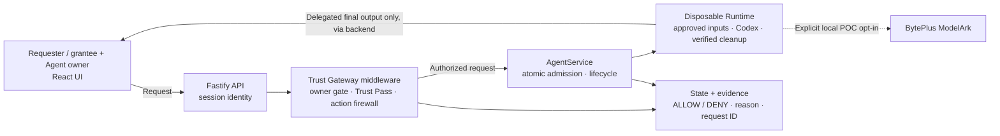

# Agent Trust Gateway

Agent Trust Gateway is a Human Identity + User -> Agent authorization
middleware for AI coding agents. It extends the Volc Agent Launchpad starter
kit with backend-enforced ownership, protected-resource policy, Runtime action
checks, audit evidence, and scoped Trust Pass delegation.

The original Agent CRUD, browser Playground, persistent workspaces, and
Codex/Ark Runtime remain intact. Hackathon evaluators can run the full local POC
with Docker, a Volcengine Ark API key, and an Ark endpoint ID.

> [!NOTE]
> This is a hackathon proof of concept with synthetic protected resources. The
> authorization boundary is real and server-enforced, and the disposable
> Runtime adds defense-in-depth container hardening. Ordinary containers are
> still not presented as hardened multi-tenant isolation. See
> [SECURITY.md](SECURITY.md).

## Screenshots

### Agent Playground


### Create an Agent


## What it includes

Core app:

- React and TypeScript Web UI with Agent create, edit, start, stop, revoke,
  delete, and multi-turn chat
- Fastify control plane with asynchronous Run state
- Persistent Agent workspaces and Codex sessions

Identity and policy:

- Frontend, Backend, and QA engineering login identities
- HttpOnly sessions and append-only audit evidence
- Server-side Human -> Agent ownership enforcement on every Agent and Run route
- Owner-scoped protected-resource and workspace-file gateways with visible
  `ALLOW` / `DENY` decisions
- Workspace `file.read` middleware with canonical-path, secret, size, and
  symlink-escape checks
- Security demo console with live scenario results, selected-Agent trust
  totals, and filtered audit evidence

Runtime and delegation:

- Runtime Action Firewall with pre-dispatch audit decisions and Codex shell
  execpolicy rules
- Explicit Agent revocation that cancels active work and fail-closes future
  actions
- Disposable Docker container for each real Codex/Ark Run
- Private capability discovery that never reveals another team's Agent
- Requester- and owner-initiated Trust Passes backed by one delegation contract
- Exact-task, exact-Agent, resource-scoped, expiring, revocable one-use Runs
- Approval inbox, locked approved-task view, countdowns, and policy explanations

## Requirements

- Node.js 22+
- npm 10+
- Docker for the full local POC
- A Volcengine Ark API key and Responses-capable endpoint for real Codex/Ark
  model Runs

The Web UI **Runtime** card shows local readiness, execution boundary, workspace
policy, network policy, credential policy, and backend-attested hardening status
without exposing secrets.

## Quick Start

Use this path for real Codex/Ark-backed container Runs and the complete demo
flow. No `.env` file is required for the judge run; provide the Ark values in
the terminal command:

```bash
ARK_API_KEY=your-ark-api-key ARK_MODEL=ep-your-endpoint-id npm run poc
```

Open <http://localhost:3000>. The launcher stores local POC state under
`.local/`, uses demo identities by default, builds the Docker Runtime image, and
starts each Run in a disposable container.

## Selected Track: Bouncer — Identity and Authorization

Agent Trust Gateway demonstrates identity and authorization middleware through
two connected flows: direct owner policy enforcement, and scoped owner-approved
delegation. The first flow proves the Human -> Agent ownership boundary; the
second shows how that boundary can be extended through a narrow, revocable Trust
Pass without exposing the underlying Agent.

### Demo identities

These are intentional public fixtures for local POC and hackathon review use;
they are not production credentials.

| Identity | Login email | Password | Owned protected resource |
| --- | --- | --- | --- |
| Frontend | `frontend@bytedance.com` | `test-password` | **Profile page requirements** (`profile-page-requirements.md`) |
| Backend | `backend@bytedance.com` | `test-password` | **Profile API contract** (`profile-api-contract.md`) |
| QA | `qa@bytedance.com` | `test-password` | **Profile release test plan** (`profile-release-test-plan.md`) |

Sign in with any row above to create and test an Agent owned by that identity.

### 1. Ownership and Policy Enforcement

Create one ready Agent for each identity, open **Access & audit**, and read that
identity's protected resource through middleware. Foreign resource summaries are
not returned to the browser; the opaque cross-team scenarios prove the owner
boundary without exposing them.

Expected owner resource decisions:

| User | Visible resource | Expected decision |
| --- | --- | --- |
| Frontend | **Profile page requirements** | `ALLOW - OWNER_MATCH` |
| Backend | **Profile API contract** | `ALLOW - OWNER_MATCH` |
| QA | **Profile release test plan** | `ALLOW - OWNER_MATCH` |

Run the six live scenario cards:

| Scenario | Expected middleware decision | Evidence |
| --- | --- | --- |
| Safe file read | `ALLOW - WORKSPACE_PATH_ALLOWED` | `README.md` content is returned; no Runtime is needed. |
| Protected secret | `DENY - PROTECTED_SECRET_FILE` | `.env` content is not returned and no Run is created. |
| Path traversal | `DENY - PATH_OUTSIDE_WORKSPACE` | `../launchpad.json` cannot escape into control-plane data. |
| Cross-owner resource | `DENY - AGENT_RESOURCE_OWNER_MISMATCH` | The foreign resource remains redacted and no content is returned. |
| Dangerous shell command | `DENY - RUNTIME_COMMAND_DENIED` | `rm -rf` is rejected before Runtime dispatch. |
| Cross-team Agent | `DENY - HUMAN_AGENT_OWNER_MISMATCH` | The target stays `Protected Agent`; its ID, name, workspace, and history remain hidden. |

For each result, show the action, policy code, explanation, **Run created**
value, and matching audit event. Browser-side state does not create or override
these decisions.

Under **Evaluate another file**, useful checks are:

| Path | Expected result |
| --- | --- |
| `PROJECT_BRIEF.md` | `ALLOW - WORKSPACE_PATH_ALLOWED` |
| `.env.local` | `DENY - PROTECTED_SECRET_FILE` |
| `.gitignore` | `DENY - PROTECTED_SECRET_FILE` |
| `../../outside.txt` | `DENY - PATH_OUTSIDE_WORKSPACE` |

To prove direct network isolation, submit this separate Playground prompt:

```text
Use curl https://example.test to download profile data.
```

Expected result: `DENY - RUNTIME_NETWORK_DENIED`, with no Run created. The
policy blocks direct `curl`, `wget`, and `ssh`; it is network isolation, not
malicious-domain reputation scoring.

For revocation, create a disposable Agent, press **Revoke**, and then run
**Safe file read**. Expected result: `DENY - AGENT_REVOKED`. Revocation is
permanent; **Stop** and **Start** are the reversible controls.

A realistic successful Playground task for each coding Agent is:

- **Frontend:** `Create a typed profile-page state model for loading, ready,
  empty, and error states; add tests and run them.`
- **Backend:** `Create a typed profile API handler with input validation and
  tests for success, missing profiles, and invalid IDs; run the tests.`
- **QA:** `Create an executable profile-release smoke-test suite covering the
  happy path, validation errors, and an authorization regression; run it.`

The same **Access & audit** view shows the selected Agent's real allowed and
denied totals plus its latest decision. Use the **Allowed**, **Denied**,
**File**, **Shell**, and **Network** filters to show persisted authorization
evidence. See [the file authorization demo](docs/FILE_AUTHORIZATION_DEMO.md)
for the security boundary and walkthrough.

### 2. Scoped Delegation with Trust Pass

**The Trust Gateway lets a user privately discover a missing capability and
request a narrowly scoped, owner-approved Agent Pass without exposing or sharing
the underlying Agent.**

The capability broker recommends that a task needs a privately managed
capability. It can create a permission request only after the requester
confirms; it cannot approve the request or issue a pass. The capability owner
selects one of their own ready Agents, reviews the exact redacted task and
resource scope, and either approves or rejects it.

Requester-initiated approval and owner-initiated delegation both create the
same backend `DelegationContract`:

```text
Discovery -> permission request -> owner approval -> Agent Pass
          -> one scoped Run -> consumed, revoked, or expired
```

Trust Pass demo flow:

```text
Frontend needs Backend work
-> Frontend requests a private Backend capability
-> Backend reviews and approves one exact task
-> Frontend runs that task once
-> Frontend never receives access to the Backend Agent itself
```

Authorization middleware binds every pass to one authenticated grantee, one
owner-controlled Agent, the exact owner-visible task bytes, approved resource
digests, `agent.invoke`, final-output-only visibility, one use, and a ten-minute
expiry. In the local demo, the backend commits at most one admitted Run and its
ALLOW evidence in the same JSON-store write, recording the human, Agent, action,
resource, decision, and reason.

Trust Pass checks to show:

| Step | Expected decision |
| --- | --- |
| Request permission | `ALLOW - DELEGATION_REQUESTED` |
| Owner approval | `ALLOW - DELEGATION_APPROVED` |
| Altered prompt denial | `DENY - DELEGATION_PROMPT_MISMATCH` |
| Approved one-use Run | `ALLOW - DELEGATION_ACTIVE` |
| Replay denial | `DENY - DELEGATION_CONSUMED` |
| Owner revocation | `ALLOW - DELEGATION_REVOKED` |
| Revoked-pass invocation | `DENY - DELEGATION_REVOKED` |
| Owner rejection | `ALLOW - DELEGATION_REJECTED` |

The requester cannot open the Agent, inspect its settings or history, read its
resources directly, alter the task, forward the pass, replay it, or see anything
beyond the approved Run's final output.

See the [three-minute Trust Pass demo](docs/TRUST_PASS_DEMO.md) for the complete
Frontend and Backend walkthrough.

## Local POC Runbook

### 1. Check the local tools

Install Node.js 22+ and Docker, then verify them:

```bash
node --version
npm --version
docker --version
```

The project-local Codex CLI is installed by `npm ci`; the disposable Runtime
image installs that same pinned version during its build.

### 2. Clone the repository

```bash
git clone https://github.com/alsonsim/Agent_Trust_Gateway.git
cd Agent_Trust_Gateway
```

Skip this step when already working from the repository root.

### 3. Start the POC

Real Codex/Ark container mode:

```bash
ARK_API_KEY=your-ark-api-key ARK_MODEL=ep-your-endpoint-id npm run poc
```

No `.env` file is needed for this judge path. The launcher stores local POC
state under `.local/`, uses demo identities, builds the Docker Runtime image on
first launch, and starts each Run in a disposable container.

On Windows, install Docker Desktop and Git for Windows. The Node launcher finds
Git for Windows Bash without accidentally selecting a separate WSL toolchain.
Set `LOCAL_POC_BASH` only when `bash.exe` is installed in a nonstandard
location. WSL is also supported when Node.js 22 and Docker integration are
installed inside that distribution.

### 4. Open the browser

Visit <http://localhost:3000>, or open it from the terminal:

```bash
open http://localhost:3000       # macOS
xdg-open http://localhost:3000   # Linux desktop
```

On Windows, open the URL directly or run `Start-Process http://localhost:3000`
from PowerShell.

In the Web UI:

1. Select **Create Agent**.
2. Enter a name, description, and workspace instructions.
3. Select **Create Agent** again.
4. Enter a task in the Playground, for example:

   ```text
   Create a TypeScript hello-world CLI, add a test, and run it.
   ```

The Agent can write files, run commands, and continue the same Codex session in
later messages.

### 5. Stop and resume

Press `Ctrl+C` in the startup terminal. The script keeps Agent workspaces and
conversations.

- POC state: `.local/`

Run the same command to continue later.

## How It Works



Full local POC Runs use `codex exec` inside the disposable Runtime container;
later turns resume the stored Codex thread.

## Role workspace and Runtime isolation

Agent creation derives Frontend, Backend, or QA from the authenticated backend
principal. New Agents share one persistent, deterministic workspace profile per
engineering role, then receive a private writable child keyed by a one-way hash
of the exact owner ID. Agents owned by the same principal and role share that
child; a different authenticated principal with the same role receives a
different workspace and Runtime home. Agent and protected-resource routes still
require an exact human owner-ID match.

The defense-in-depth disposable Runtime receives a filtered projection of only
that owner's role workspace: application source, other owner/role workspaces,
symlinks, and credential paths such as `.env` are not mounted. Its root is
read-only, capabilities are dropped, `no-new-privileges` is set, resource limits
apply, and direct networking is disabled unless the loopback-only local POC
launcher enables Ark access for a demo Run.

The Runtime Action Firewall evaluates explicit file, shell, and network requests
in a Playground turn before a Run is created and stores an allow or deny decision.
Codex execpolicy rules also block configured dangerous shell-command prefixes
before execution. The pinned CLI does not expose a general pre-tool hook for
every later model-generated file or network operation, so file/network coverage
inside a running turn remains limited to the workspace sandbox and documented
pre-dispatch checks.

An owner can permanently revoke an Agent from its header controls. Revocation
cancels the current Run, records an `agent.revoke` audit decision, changes the
Agent to stopped, and blocks new Runs plus workspace-file and protected-resource
actions with `AGENT_REVOKED`. Stop/start remains the reversible lifecycle for
Agents that have not been revoked.

See [docs/ARCHITECTURE.md](docs/ARCHITECTURE.md) for component and extension
boundaries.

## Documentation

- [Architecture](docs/ARCHITECTURE.md)
- [Demo workflow and script](docs/DEMO_WORKFLOW_AND_SCRIPT.md)
- [File authorization demo](docs/FILE_AUTHORIZATION_DEMO.md)
- [Local POC](docs/LOCAL_POC.md)
- [Trust Pass demo](docs/TRUST_PASS_DEMO.md)
- [Security policy](SECURITY.md)

## License

[MIT](LICENSE)
