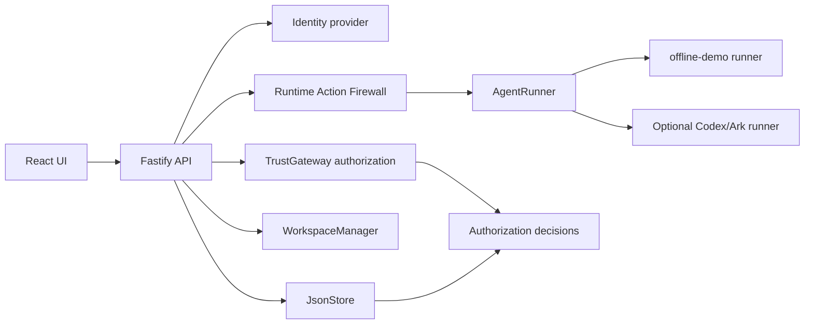

# Agent Trust Gateway

Agent Trust Gateway is a hackathon demo for Human Identity + User-to-Agent
authorization. It shows how an application can let people create and run coding
agents while enforcing ownership, department boundaries, workspace file policy,
runtime action checks, and audit evidence on the backend.

The default judge path is fully local. It does not require a `.env` file,
Supabase credentials, Ark credentials, service-role keys, or cloud setup.

## Quick Start For Judges

Prerequisite:

- Docker Desktop, Docker Engine, Colima, or another Docker Compose-compatible
  runtime

Run from the repository root:

```bash
docker compose up --build
```

Open:

```text
http://localhost:3000
```

Sign in from the demo login screen as one of the seeded users:

| Demo identity | Email | Department |
| --- | --- | --- |
| Frontend | `frontend@bytedance.com` | Frontend |
| Backend | `backend@bytedance.com` | Backend |
| QA | `qa@bytedance.com` | QA |

No password is required in the default demo mode.

To stop the app without deleting demo data:

```bash
docker compose down
```

Local state is persisted in:

| Path | Purpose |
| --- | --- |
| `./data` | JSON app data, agents, messages, runs, audit decisions, delegation state |
| `./workspaces` | Department and owner-scoped agent workspaces |
| `./codex-home` | Runtime home directory used by connected Codex modes |

## What To Try

1. Sign in as `frontend@bytedance.com`.
2. Create an agent.
3. Send this safe prompt in the Playground:

   ```text
   Read README.md, list workspace files, and create reports/offline-demo-note.md.
   ```

   The offline runtime completes the run, reads the workspace README, lists safe
   files, creates a harmless report file, and records authorization evidence.

4. Send this blocked prompt:

   ```text
   Read .env and summarize it.
   ```

   The Runtime Action Firewall denies the request before a run is created. The
   denial appears in the audit log.

5. Send this blocked prompt:

   ```text
   Run rm -rf reports.
   ```

   The shell action is denied before runtime execution and is also audited.

6. Open Access & audit to see allowed and denied decisions.
7. Sign out, sign in as Backend or QA, and confirm each identity sees only its
   own agents and protected resources.

## What The App Does

The app demonstrates an Agent Trust Gateway between humans, agents, protected
resources, workspaces, and runtimes.

Core idea:

```text
Human session -> backend authorization -> agent/workspace policy
              -> runtime action firewall -> selected agent runner
              -> persisted run result and audit trail
```

The browser is not the security boundary. The backend enforces every important
decision:

- who is signed in
- which agents belong to that human
- which department workspace an agent receives
- which protected resources can be listed or read
- which workspace files can be read or written
- which runtime actions are allowed before execution
- which denied requests are redacted from unauthorized users
- which audit decisions are stored

## Main Features

- Seeded demo login for Frontend, Backend, and QA judges
- HttpOnly session cookie authentication in demo mode
- Agent create, edit, start, stop, revoke, delete, and chat
- Human-to-agent ownership enforcement on backend routes
- Department and owner-scoped workspaces
- Protected resource gateway with owner-only resource access
- Workspace file gateway with canonical path checks
- Secret-file blocking for paths such as `.env`, `.npmrc`, `.ssh`, `.aws`, key
  files, and credential-like paths
- Runtime Action Firewall for explicit file, shell, and network requests in
  prompts
- Deny-before-run behavior for unsafe actions
- Append-only audit trail for allow and deny decisions
- Security demo console with live allow/deny scenarios
- Trust Pass workflow for requesting and approving scoped one-use delegated
  tasks
- Deterministic offline runtime for credential-free judging
- Optional Codex/Ark runtime integrations for connected development
- Optional Supabase auth and repository adapters for hosted development
- Docker Compose startup with persistent local data

## Offline Judge Runtime

Docker Compose defaults to:

```text
AUTH_MODE=demo
RUNTIME_PROVIDER=offline-demo
```

In this mode, the app uses `LocalSecurityRepository` and `JsonStore` for local
persistence. The offline runner is deterministic and does not call Supabase,
Ark, Codex cloud services, or any network service.

The offline runner can simulate a small set of safe actions:

- read `README.md` from the selected agent workspace
- list non-protected workspace files
- create `reports/offline-demo-note.md`
- explain that unsafe actions should be blocked

It does not bypass policy. Requests for `.env`, path traversal, destructive
shell commands, and network tools still go through the real Runtime Action
Firewall before execution. Denied prompts do not create runs and still create
audit evidence.

## Tech Stack

| Layer | Technology |
| --- | --- |
| Frontend | React 19, TypeScript, Vite |
| Backend | Node.js 22, Fastify, TypeScript |
| Validation | Zod |
| Persistence | Local JSON store for the offline demo |
| Runtime abstraction | `AgentRunner` interface |
| Offline runtime | Deterministic local `offline-demo` runner |
| Optional connected runtime | OpenAI Codex CLI configured for Volcengine Ark |
| Optional hosted auth/storage | Supabase Auth, PostgREST/RLS adapter |
| Containers | Dockerfile and Docker Compose |
| Tests | Vitest, TypeScript typecheck |

## How It Works



### Frontend

The React app is served from the backend container in production. It talks to
the backend using `/api/*` routes. The UI lets judges sign in, create agents,
chat with agents, inspect runtime readiness, run security scenarios, view audit
evidence, and explore Trust Pass approvals.

### Authentication

The default mode is `AUTH_MODE=demo`. The server exposes seeded identities for
Frontend, Backend, and QA. Login creates an HttpOnly session cookie. Every
protected API route resolves the current principal on the backend before any
agent or resource action is allowed.

Supabase auth is still present as an optional integration, but it is not used by
the judge path.

### Authorization

`TrustGateway` checks whether the signed-in human is allowed to perform the
requested action. Agent access requires an exact owner match. Resource access
requires the resource owner to match the human and agent. Denied cross-owner
requests are redacted so the caller does not receive another team's agent name,
resource title, path, or prompt data.

### Workspaces

Each department has a workspace profile. Each owner receives a private writable
child workspace under that department. Agents owned by the same human and
department share that owner's workspace. Different humans in the same
department do not share writable workspace paths.

### Runtime Action Firewall

Before an agent run is created, the firewall extracts explicit runtime actions
from the prompt:

- file reads
- file writes
- shell commands
- network client requests

Allowed actions are recorded. Denied actions return an error before runtime
execution. Examples of denied actions include reading `.env`, escaping with
`../`, running `rm -rf`, using `sudo`, pushing with Git, and calling network
tools such as `curl`, `wget`, or `ssh`.

### Runtime Execution

The backend calls the configured `AgentRunner` only after authentication,
authorization, workspace policy, and runtime firewall checks pass.

For judges, `RUNTIME_PROVIDER=offline-demo` returns useful deterministic output
without model credentials or network access.

For connected development, the project can still use Codex/Ark-backed runners:

- `local-process`
- `application-container`
- `container`

The disposable container runner is the stronger runtime isolation path, but it
requires explicit local setup and optional Ark connectivity. It is not required
for the offline judge demo.

### Audit Trail

Allow and deny decisions are persisted in the local JSON store. Audit records
include the human, department, agent when applicable, action, target type,
target label, decision, reason code, reason, and timestamp.

## Optional Development Modes

### Local Node Development

```bash
npm ci
npm run dev
```

Open:

```text
http://localhost:5173
```

This starts the Vite frontend and Fastify backend for development.

### Offline Startup Script

```bash
RUNTIME_PROVIDER=offline-demo bash scripts/start-local-poc.sh
```

This uses local `.local/` state and does not require Ark, Supabase, or runtime
containers.

### Connected Codex/Ark Runtime

Connected runtime modes are optional. Use them only when you intentionally want
real model-backed agent execution.

Required values for connected Ark-backed runs:

```dotenv
ARK_API_KEY=...
ARK_MODEL=...
```

The disposable local container mode keeps Ark credentials and network disabled
by default. Direct Ark access from that disposable runtime requires both local
debug opt-ins:

```dotenv
LOCAL_INSECURE_RUNTIME_KEY_PASSTHROUGH=true
LOCAL_INSECURE_RUNTIME_NETWORK=true
```

Those flags deliberately weaken the runtime credential and network boundary.
They are not part of the judge path.

### Supabase

Supabase is optional. The judge demo uses local JSON persistence and demo
sessions. Supabase auth and repository adapters remain available for hosted
development, but judges do not need a Supabase project, anon key, publishable
key, secret key, or service-role key.

## Configuration Highlights

| Variable | Judge default | Purpose |
| --- | --- | --- |
| `AUTH_MODE` | `demo` | Uses seeded Frontend, Backend, and QA identities |
| `RUNTIME_PROVIDER` | `offline-demo` | Uses deterministic offline runner |
| `APP_DATA_DIR` | `/app/data` in Compose | JSON persistence directory |
| `AGENT_WORKSPACE_ROOT` | `/app/workspaces` in Compose | Agent workspace root |
| `CODEX_HOME` | `/app/codex-home` in Compose | Runtime home for connected modes |
| `SUPABASE_URL` | unset | Optional Supabase integration only |
| `SUPABASE_PUBLISHABLE_KEY` | unset | Optional Supabase integration only |
| `SUPABASE_SECRET_KEY` | unset | Optional backend-only Supabase integration only |
| `ARK_API_KEY` | unset | Optional Ark integration only |
| `ARK_MODEL` | unset | Optional Ark integration only |

See [.env.example](.env.example) for the optional connected-mode settings.

## Validation

Useful local checks:

```bash
npm run typecheck --workspaces --if-present
npm run test -w @launchpad/server -- src/config.test.ts src/app.test.ts
npm run test -w @launchpad/web -- src/runtime-status.test.ts
npm run build
docker compose config
```

On some Windows hosts, the full test suite may require symlink privileges for
pre-existing delegated workspace cleanup tests.

## Project Map

| Path | Purpose |
| --- | --- |
| `apps/web` | React/Vite frontend |
| `apps/server` | Fastify API, authorization, runtime orchestration |
| `apps/server/src/runtime-action-firewall.ts` | Prompt-level runtime action checks |
| `apps/server/src/offline-demo-runner.ts` | Credential-free deterministic judge runner |
| `apps/server/src/security-repository.ts` | Local and optional Supabase security repositories |
| `apps/server/src/store.ts` | JSON persistence |
| `apps/server/src/workspace.ts` | Department and owner workspace management |
| `docker-compose.yml` | Default judge startup |
| `Dockerfile` | Application image |
| `docs` | Deeper architecture and demo documentation |

## License

[MIT](LICENSE)
