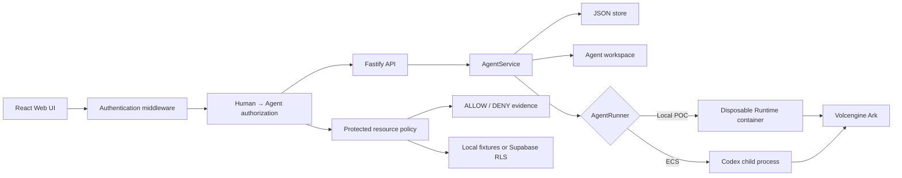

# Architecture

Agent Trust Gateway is a single-node control plane with an identity and
authorization middleware boundary for hackathon use.



## Components

### Web UI

Authenticates Finance, HR, or Research; lists only owned Agents; manages the
unchanged lifecycle and Playground; and displays backend-produced policy
decisions. It never receives Ark or Supabase server keys.

### Fastify API

Validates requests, resolves an HttpOnly session to a human principal, and
checks stored Agent ownership before every Agent/message/Run operation. A
legacy shared-token mode remains available only for starter-kit compatibility.

### TrustGateway

Derives the Agent principal from the stored Agent, compares human/Agent/resource
ownership, fails closed before protected content is returned, and persists
attributed `ALLOW`/`DENY` evidence. The same policy contract uses local
synthetic files in demo mode or Supabase Auth, tables, and RLS in Supabase mode.

### AgentService

Coordinates lifecycle state, persistence, workspaces, and Runs. One Agent can
have only one active Run.

```text
ready -> busy -> ready
  |       |
  v       v
stopped  error
```

Interrupted Runs become `cancelled` after a restart.

### Storage

```text
data/launchpad.json       Agent, message, and Run metadata
workspaces/AgentID/       Agent-created files
workspaces/.deleted/      Archived deleted workspaces
codex-home/               Codex configuration and sessions
```

`JsonStore` serializes writes and atomically replaces one JSON file. It supports
one process only.

### Runtime providers

- `CodexRunner` runs Codex inside the application container for ECS.
- `ContainerCodexRunner` starts one disposable Docker, Colima, or Podman
  container for every local turn.

Both providers use argv-only process execution, bound output and time, resume
the stored Codex thread, and escalate termination after a grace period.

## Deployment profiles

| Profile | Control plane | Agent execution |
| --- | --- | --- |
| Local POC | Host Node.js | Disposable local container |
| ECS | Application container | Codex process in the same container |
| Local development | Host Node.js | Host Codex process |

## Extension seams

| Track | Primary seam | Expected change |
| --- | --- | --- |
| Glass Box | `AgentRunner`, `AgentRun` | Emit and display correlated execution events. |
| Bouncer | API routes, Agent ownership | Add identity and server-side authorization. |
| Kill Switch | `AgentRunner` | Add threat-specific policy or a stronger sandbox. |

The current container or ECS instance is the POC trust boundary. Ordinary
containers are not hardened multi-tenant isolation.
