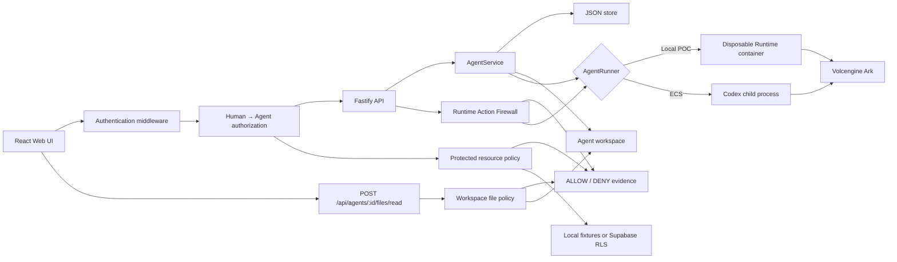

# Architecture

Agent Trust Gateway is a single-node control plane with an identity and
authorization middleware boundary for hackathon use.



## Components

### Web UI

Authenticates Finance, HR, or Research; lists only owned Agents; manages the
unchanged lifecycle and Playground; and displays backend-produced policy
decisions. It never receives Ark or Supabase server keys.

### Fastify API

Validates requests, resolves an HttpOnly session to a human principal, and
checks stored Agent ownership before every Agent/message/Run operation. A
legacy shared-token mode remains available only for starter-kit compatibility.

### TrustGateway

Derives the Agent principal from the stored Agent, compares human/Agent/resource
ownership, fails closed before protected content is returned, and persists
attributed `ALLOW`/`DENY` evidence. The same policy contract uses local
synthetic files in demo mode or Supabase Auth, tables, and RLS in Supabase mode.

`readWorkspaceFile()` is a separate server-enforced file boundary for an
Agent's assigned workspace. It verifies the authenticated owner, canonicalizes
the workspace and requested file, blocks traversal and symlink escapes, blocks
known credential paths, applies a 256 KiB read limit, persists an authorization
decision, and only then returns allowed content. The audit label is a normalized
requested path, never file contents.

### AgentService

Coordinates lifecycle state, persistence, workspaces, and Runs. One Agent can
have only one active Run.

```text
ready -> busy -> ready
  |       |
  v       v
stopped  error
```

Interrupted Runs become `cancelled` after a restart.

### Agent revocation

`Agent.revokedAt` is a persistent security state separate from the reversible
`ready`/`stopped` lifecycle. `POST /api/agents/:id/revoke` requires the
authenticated owner, asks `AgentService` to cancel any active execution, marks
the Agent stopped and revoked, and persists an `agent.revoke` decision. The
Trust Gateway denies new `agent.start`, `agent.invoke`, `resource.read`, and
`file.read` decisions with `AGENT_REVOKED`; `AgentService` repeats the check
immediately before Run creation so a runner is never called after revocation.
Existing Runs remain readable to their owner for audit and troubleshooting.

### Storage

```text
data/launchpad.json       Agent, message, and Run metadata
workspaces/AgentID/       Agent-created files
workspaces/.deleted/      Archived deleted workspaces
codex-home/               Codex configuration and sessions
```

`JsonStore` serializes writes and atomically replaces one JSON file. It supports
one process only.

### Workspace file authorization

`POST /api/agents/:id/files/read` accepts `{ "path": "README.md" }` for the
currently authenticated owner of an Agent. Policy decisions use `file.read` and
target type `file`. The policy permits ordinary files inside that Agent's
canonical workspace and denies outside paths, `..` traversal, symlink escapes,
protected credential names/directories, and files larger than 256 KiB.

### Runtime Action Firewall

Before `AgentService` creates a Run or invokes either runner, the Runtime Action
Firewall evaluates explicit file reads/writes, shell commands, and network
requests named in the submitted Playground turn. File paths reuse the workspace
file policy. Every evaluated action is persisted as an attributed allow or deny
decision before execution proceeds; audit persistence failure prevents an allow
from running.

The generated `$CODEX_HOME/execpolicy/runtime-action-firewall.rules` file is the
earliest real model-action boundary available in the pinned Codex CLI. Codex
evaluates its shell command rules before model-generated shell execution. It
allows `npm test`, `npm run test`, `npm run build`, `git status`, and `git diff`,
and forbids `rm -rf`, `sudo`, `chmod 777`, `curl`, `wget`, `ssh`, `docker run`,
and `git push`. The container runner additionally removes capabilities, sets
`no-new-privileges`, and only bind-mounts the Agent workspace and Codex home.

The JSONL event stream is deliberately not used for policy decisions because it
reports completion events after actions have run. The pinned CLI has no stable
general pre-tool hook for every file read/write or network action. Consequently,
later model-generated file and network actions are not fully intercepted by this
application: they rely on Codex `workspace-write` sandboxing and the container
mount boundary. This is not claimed as complete tool-level interception.

### Runtime providers

- `CodexRunner` runs Codex inside the application container for ECS.
- `ContainerCodexRunner` starts one disposable Docker, Colima, or Podman
  container for every local turn.

Both providers use argv-only process execution, bound output and time, resume
the stored Codex thread, and escalate termination after a grace period.

## Deployment profiles

| Profile | Control plane | Agent execution |
| --- | --- | --- |
| Local POC | Host Node.js | Disposable local container |
| ECS | Application container | Codex process in the same container |
| Local development | Host Node.js | Host Codex process |

## Extension seams

| Track | Primary seam | Expected change |
| --- | --- | --- |
| Glass Box | `AgentRunner`, `AgentRun` | Emit and display correlated execution events. |
| Bouncer | API routes, Agent ownership | Add identity and server-side authorization. |
| Kill Switch | `AgentRunner` | Add threat-specific policy or a stronger sandbox. |

The current container or ECS instance is the POC trust boundary. Ordinary
containers are not hardened multi-tenant isolation.
